# ASI-Chain Architecture Overview

This document provides a comprehensive overview of the ASI-Chain system architecture, including components, interactions, and design decisions.

## Table of Contents
1. [System Overview](#system-overview)
2. [Network Architecture](#network-architecture)
3. [Component Architecture](#component-architecture)
4. [Data Flow](#data-flow)
5. [Consensus Mechanism](#consensus-mechanism)
6. [Smart Contract System](#smart-contract-system)
7. [Security Architecture](#security-architecture)

## System Overview

ASI-Chain is a blockchain implementation based on RChain technology, featuring:
- **CBC Casper** consensus with Proof of Stake
- **Rholang** smart contract language (process calculus-based)
- **gRPC** for network communication
- **Multi-node** architecture with specialized node types

### High-Level Architecture

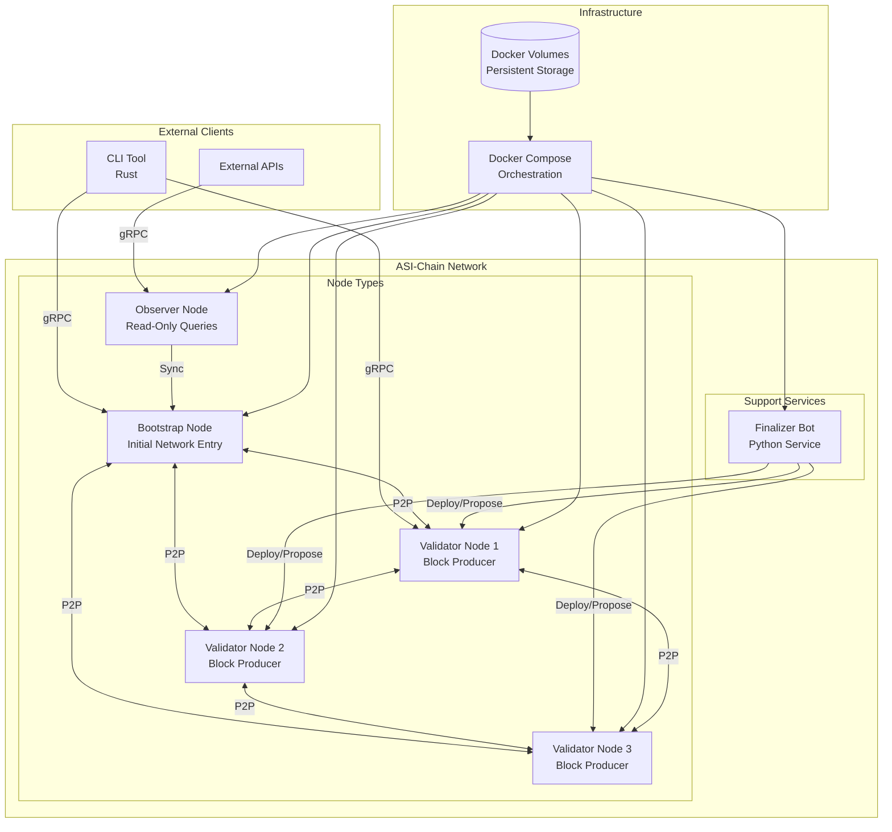

## Network Architecture

### Node Types and Responsibilities

| Node Type | Purpose | Capabilities | Port Range |
|-----------|---------|--------------|------------|
| **Bootstrap** | Network initialization | Deploy, Propose, Query | 40400-40405 |
| **Validator** | Block production | Deploy, Propose, Query | 40410-40435 |
| **Observer** | Read-only access | Query only | 40451-40453 |

### Port Mapping

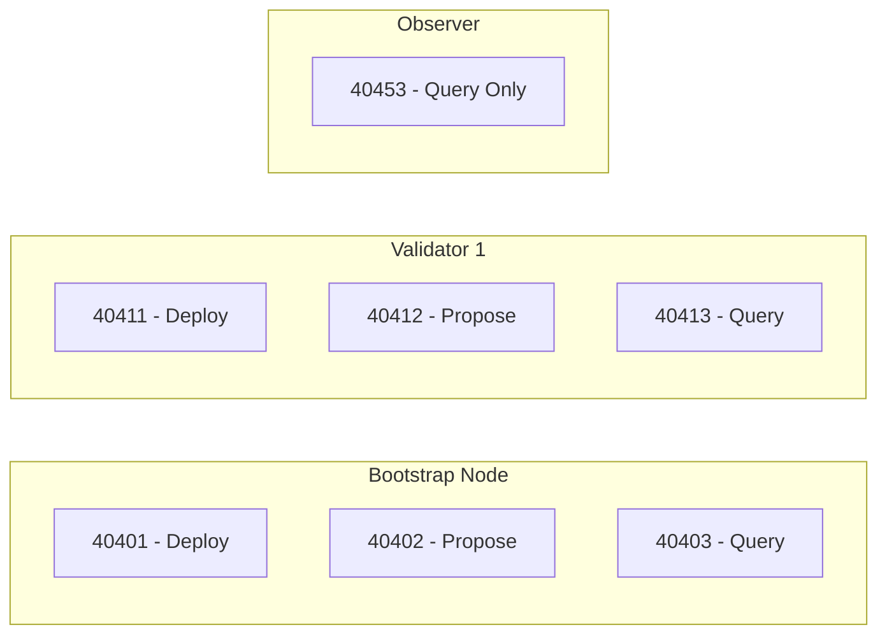

### Network Topology

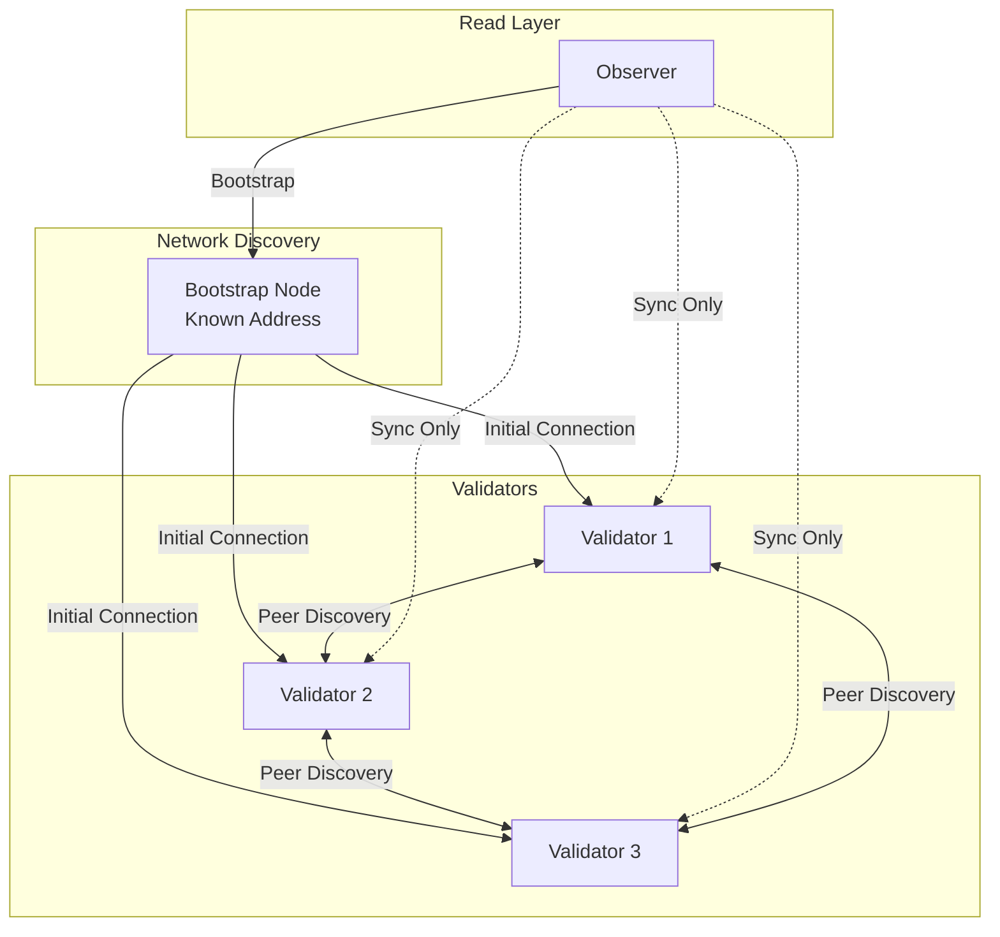

## Component Architecture

### Node Components (Scala)

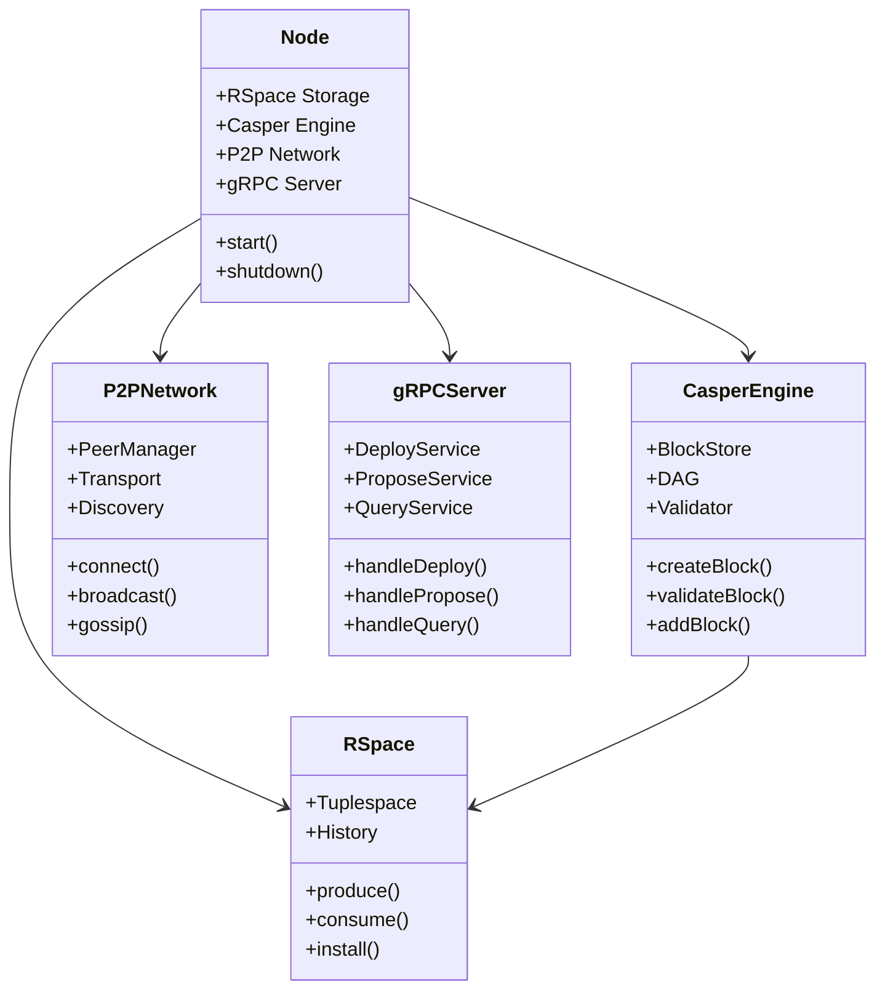

### CLI Components (Rust)

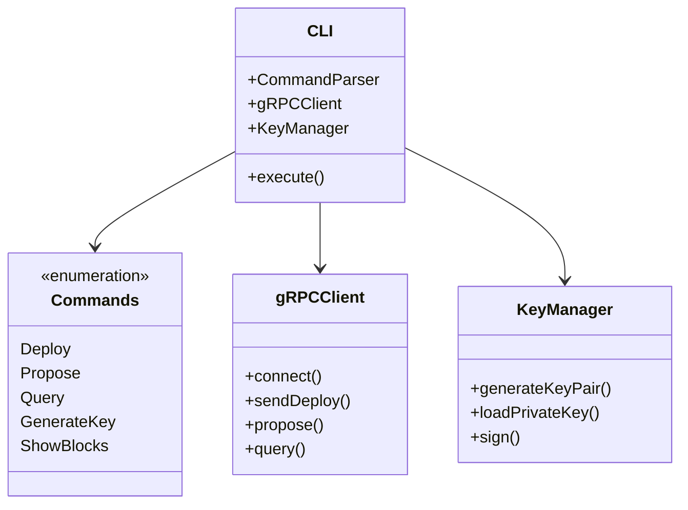

### Finalizer Bot Architecture

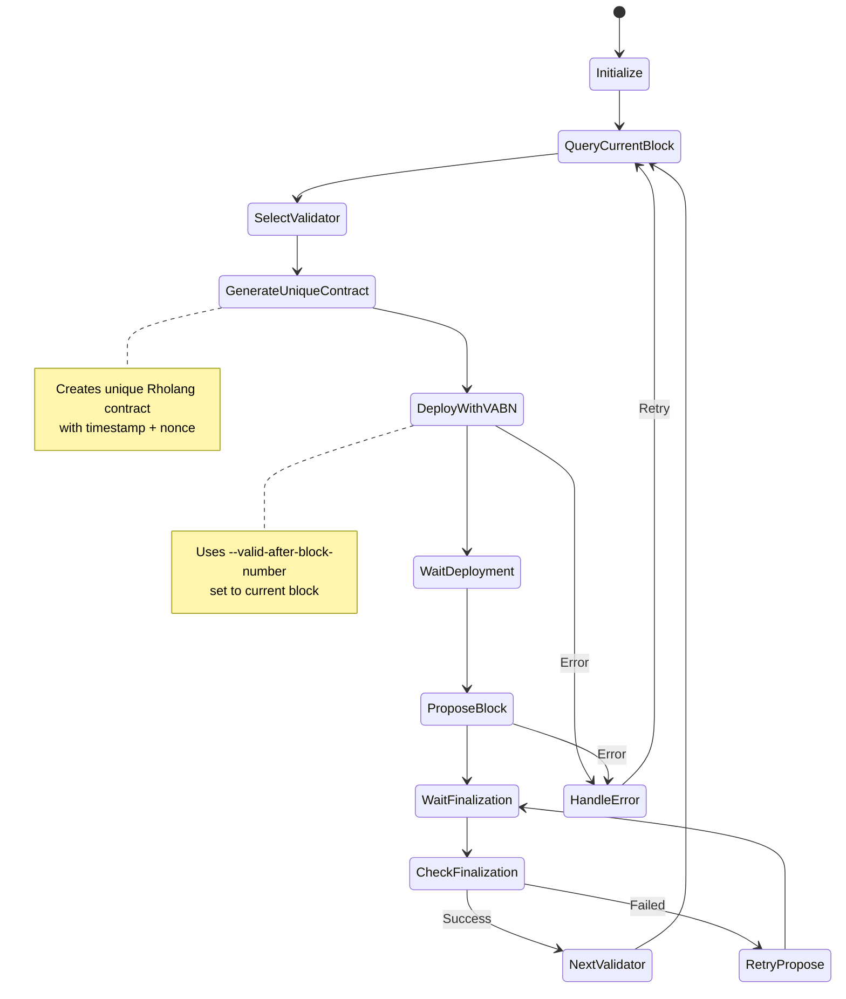

#### Finalizer Bot Implementation Details

**File Management**:
- Primary: `finalizer-bot/finalizer.py` (production version)
- Template: `finalizer-bot/finalizer_with_vabn.py` (VABN-enabled template)
- Deploy script copies template to production during deployment

**Key Features**:
- **Dynamic VABN**: Queries current block number and sets `--valid-after-block-number` accordingly
- **Unique Contracts**: Generates unique Rholang contracts with timestamps and nonces
- **Docker Networking**: Uses container names (`rnode.bootstrap`, `rnode.validator1-3`)
- **Retry Logic**: Handles connection failures and node readiness delays
- **Block 50 Resolution**: Ensures network operates indefinitely past block 50

## Data Flow

### Transaction Lifecycle

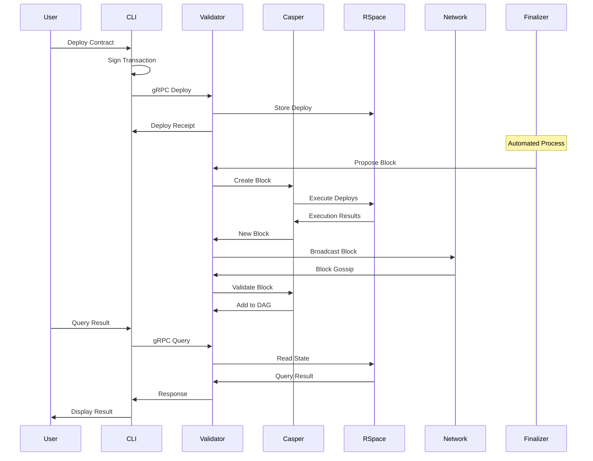

## Consensus Mechanism

### CBC Casper Implementation

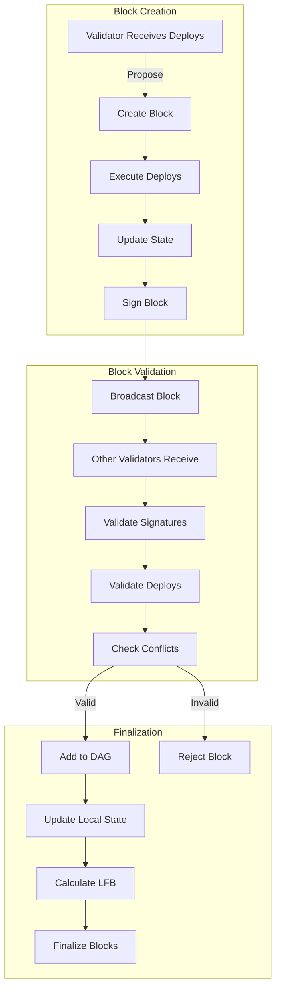

### Validator Rotation (Alternating Proposals)

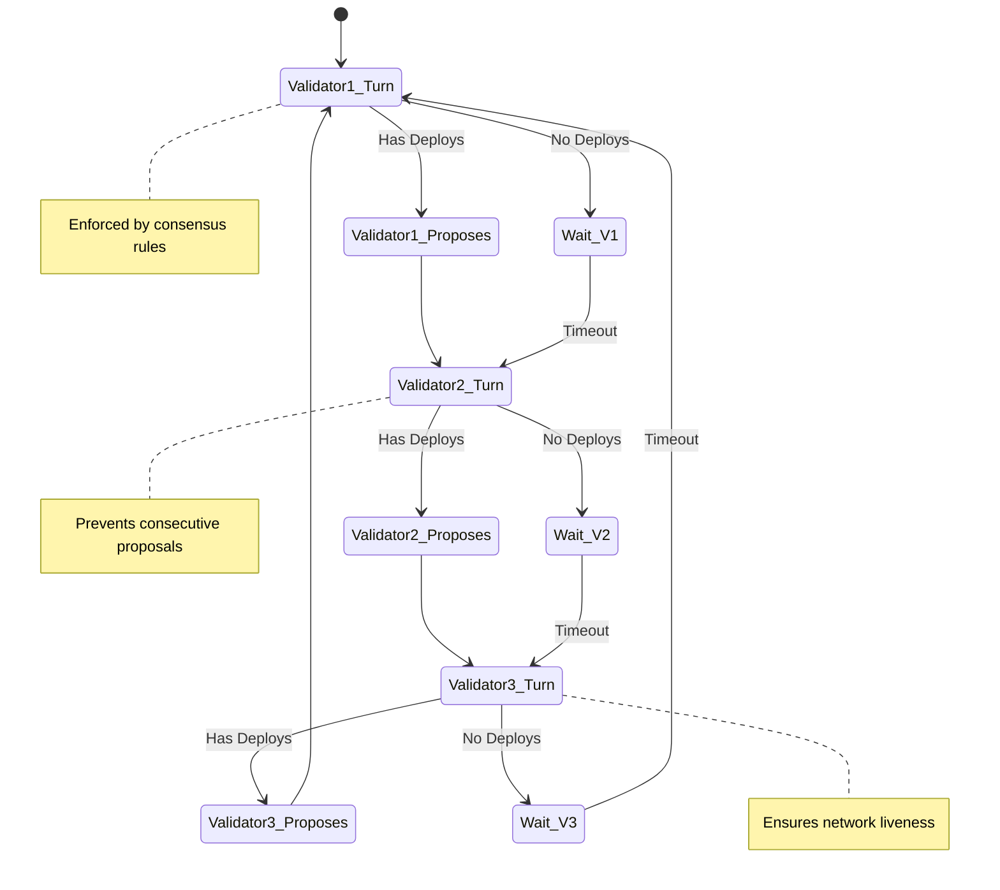

## Smart Contract System

### Rholang Execution Model

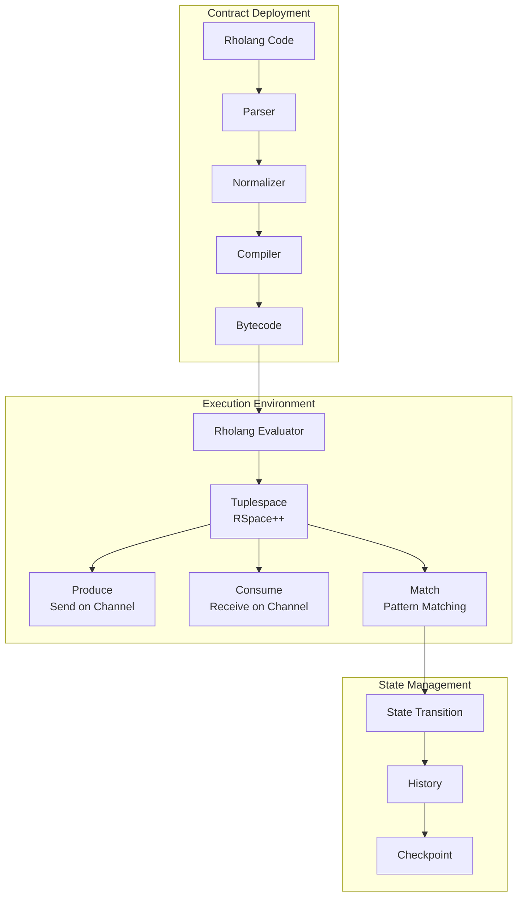

### Contract Example Flow

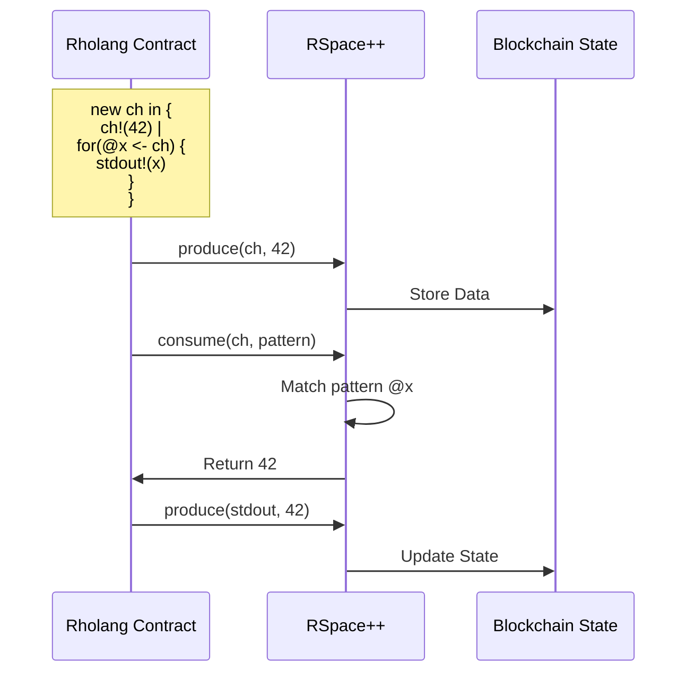

## Security Architecture

### Key Security Features

```mermaid
graph TB
    subgraph "Network Security"
        TLS[TLS Encryption<br/>Node Communication]
        Auth[Certificate-based<br/>Authentication]
        Sign[Message Signing<br/>Ed25519]
    end
    
    subgraph "Consensus Security"
        POS[Proof of Stake<br/>Sybil Resistance]
        VAL[Validator Bonds<br/>Economic Security]
        SLASH[Slashing<br/>Penalty Mechanism]
    end
    
    subgraph "Contract Security"
        ISO[Process Isolation<br/>Namespace Separation]
        CAP[Capability Security<br/>Unforgeable Names]
        REV[Rev Limiting<br/>Resource Control]
    end
    
    TLS --> Auth
    Auth --> Sign
    
    POS --> VAL
    VAL --> SLASH
    
    ISO --> CAP
    CAP --> REV
```

### Trust Model

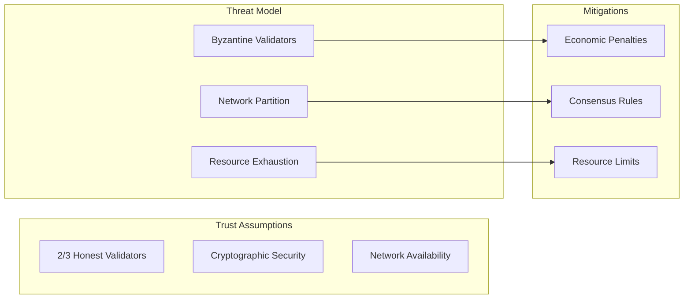

## Deployment Architecture

### Docker Compose Structure

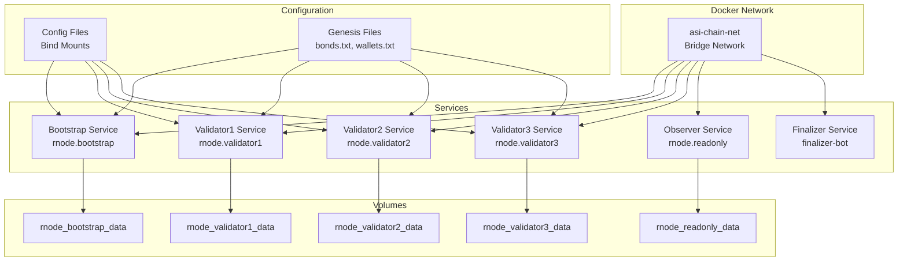

## Performance Considerations

### Scalability Factors

1. **Network Size**: Currently optimized for small validator sets (3-5 nodes)
2. **Block Size**: Limited by execution time and network propagation
3. **State Size**: RSpace++ provides efficient storage but grows over time
4. **Query Performance**: Observer nodes provide read scaling

### Known Limitations

1. **Transaction Gossip**: Currently broken, requiring direct deployment to validators
2. **Auto-propose**: Non-functional, requiring manual block proposals or finalizer bot
3. **Finalization**: Requires alternating validators due to consensus rules
4. **Network Size**: Not yet tested at scale beyond testnet configuration

## Future Architecture Improvements

1. **Sharding**: Planned for horizontal scaling
2. **Light Clients**: For mobile and resource-constrained environments
3. **State Channels**: For off-chain scaling
4. **Cross-chain Communication**: IBC-style protocols
5. **Hardware Security Modules**: For validator key management

---

For implementation details, see:
- [CLI Tutorial](../getting-started/CLI_TUTORIAL.md) - Command-line interface details
- [Test Report](../analysis/TEST_REPORT.md) - Current functionality status
- [Project Roadmap](../development/PROJECT_STATUS_AND_ROADMAP.md) - Future development plans
- [Finalizer Bot Operations](../operations/FINALIZER_BOT.md) - Detailed finalizer bot documentation
- [Block Explorer Architecture](../block-explorer/ARCHITECTURE.md) - Block explorer implementation details
- [Wallet Architecture](../wallet/architecture.md) - ASI Wallet v2 technical documentation